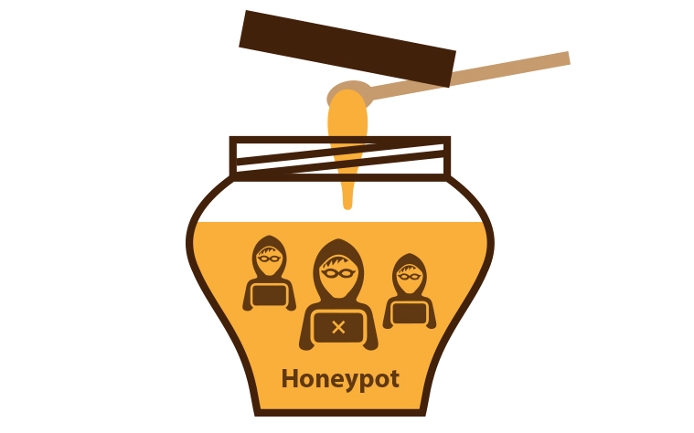

Ángel Gómez Martín - *agomezm@correo.ugr.es*

David Infante Casas - *davidinfante@correo.ugr.es*

3ºB Fundamentos de Redes

UGR - 2018/19

# HoneyPots

## Índice

1. ¿Qué son?
2. Tipos de HoneyPots.
3. Monitorización.
4. Ventajas y desventajas.
5. Ejemplos de HoneyPots.
6. ¿Dónde colocarlos?
7. Referencias.

### 1. ¿Qué son?

Los HoneyPots son una herramienta usada en el campo de la seguridad informática, cuya función es atraer y analizar diferentes tipos de ataques informáticos con el fin de obtener información acerca de éstos y poder repelerlos en un futuro próximo. 

Por un lado, un HoneyPot podría ser un equipo cualquiera en el cual no se ha hecho mucho incapié en tomar medidas de seguridad, lo que atrae más fácilmente a posibles atacantes. Por el contrario, un HoneyPot puede ser un sistema complejo de máquinas, formando una red que capte gran cantidad de información relevante de diferentes servicios, por ejemplo. Una opción común es usar un software que simule una red local con diferentes equipos y direcciones IP, lo que provoca una pérdida de tiempo al atacante.

Con este estudio de los atacantes y ataques se generan diccionarios de parámetros relevantes que luego se tienen en cuenta a la hora de confeccionar sistemas de protección.

En resumen, son un gran aliado a la hora de defender una red ya que la mejor manera de evitar un ataque es conocer el propio ataque y su forma de actuar. Algunos HoneyPots son más sencillos que otros en cuanto a configuración y manejo, pero en general todos son muy configurables.

Actualmente los HoneyPots han evolucionado, apareciendo las HoneyNets, que son redes complejas de HoneyPots que simulan redes locales completas, lo que permite obtener mucha más información.

### 2. Tipos de HoneyPots.

A grandes rasgos los HoneyPots se pueden dividir según su interacción en dos tipos:

- **Baja interacción**: Se tratan de software que simula ser un sistema operativo o un servicio concreto en una red. Son los más fáciles de usar, tienen un riesgo nulo y se suelen usar para tomar datos estadísticos sobre los ataques que sufran. Por el contrario, su mayor problema es que son bastante fáciles de descubrir por parte de atacantes experimentados, mientras que para ataques masivos serán totalmente transparentes.

- **Alta interacción**: Suelen tratarse de sistemas completos, con servicios funcionando en ellos. Esto permite que se pueda obtener mucha más información del atacante. Debido a la posición que ocupan en la red no son un blanco tan fácil, por lo que no reciben tantos ataques; aún así las ventajas compensan los inconvenientes. Requieren de una mayor configuración de seguridad pues dado el caso podrían convertirse en la puerta de entrada a los equipos de producción que se encuentran tras él.

### 3. Monitorización.

La monitorización de los HoneyPots es vital y debe hacerse de manera contínua. Los datos recogidos por los HoneyPots son de vital importancia y si cayeran en manos del atacante podrían ser usados en nuestra contra. Por tanto los datos obtenidos se tienen que extraer de inmediato.

Una vez recuperados los datos en otro sistema se analizan y filtran, para evitar posibles archivos infectados por el atacante. Por otro lado sobra decir que ningún dato relevante al resto de sistemas debe ser almacenado en el HoneyPot.

Como se comentaba anteriormente todos los datos obtenidos se almacena en diccionarios o logs, los cuales serán analizados más tarde.

### 4. Ventajas y desventajas.

#### Ventajas:

- Se encuentran en entornos aislados.
- Producen pocos falsos positivos.
- Producen datos concisos de los atacantes y ataques.
- Sirven como distracción.
- Sirven como herramienta de testeo de los sistemas de seguridad de una red o conjunto de equipos.

#### Desventajas:

- Potencialmente puede ser descubierto por el atacante y ser usado en nuestra contra.
- Puede ser utilizada por el atacante contra otros sistemas distintos al nuestro.
- Solo detecta ataques directos al HoneyPot, no detecta el entorno de la red de área local.
- Plantean una contradicción: saber si estamos seguros de querer atraer ataques a nuestra red, ya que si el HoneyPot no está correctamente configurado, puede servir como punto de entrada, lo cual sería un problema serio, ya que en vez de dificultar el acceso a los atacantes se les facilita el mismo.
- Para implantar un HoneyPot se requieren equipos extra, con el consecuente coste, ya se trate de software y hardware real o simulado.
- La dificultad de disponer de una simulación realista de dispositivos de ataque, ya que si queremos recibir un ataque, debemos de parecer lo suficiente reales para engañar al enemigo.
- Otro contrapunto es que, si de verdad se desea obtener información y aprovecharla para mejorar la seguridad, se necesita incorporar personal necesario que realice la monitorización del HoneyPot y el análisis de la información obtenida del mismo.

### 5. Ejemplos de HoneyPots.

- **T-Pot**: es una plataforma que tiene como base una distribución Ubuntu. Incluye una gran variedad de HoneyPots ya preparados, configurados y listos para entrar en funcionamiento.  Algunos son: Conpot, Cowrie, Diaonea, ElasticPot, EMobility, Glastopf, HoneyTrap, Suricata, ELK.
- **HoneyBOT**: Está hecho para Microsoft Windows y tiene una interfaz gráfica integrada. Se caracteriza por su nivel de detalle, guarda incluso todo byte recibido del atacante. Incluye interesantes gráficos que permiten ver los ataques más relevantes en un solo vistazo.
- **Specter**: es más poderoso, ya que tiene perfiles preconfigurados de varios sistemas operativos, inyecta datos codificados al atacante que permiten ser usados luego como prueba. Abre perfiles personalizados y acumulativos de cada intruso. A este programa no lo vamos a monitorizar nosotros mismos, sino que tiene informes predefinidos con datos a salvaguarda de la casa de software y desconocemos cómo los cuida porque es de código cerrado.
- **Kippo**: Está escrito en Python y está alojado en GitHub con licencia libre. Se describe como un honeypot de interacción mediana enfocado en SSH.
- **Conpot**: Es un honeypot de sistemas de control industrial de baja interacción diseñado para ser fácil de implementar, modificar y ampliar. Al proporcionar una amplia gama de protocolos industriales comunes, permite la creación de los elementos básicos para que se pueda construir casi cualquier sistema.
- **GasPot**: Diseñado para simular un medidor de tanque petrolero que ayuda a medir el nivel de combustible. GasPot fue diseñado para ser lo más aleatorio posible para que dos instancias no sean iguales. Es de código libre y se puede descargar desde su repositorio en GitHub.
- **iHoney**: Es un proyecto de investigación realizado en 2017 por el Ministerio de Industria, Energía y Turismo de España en colaboración con S2 Grupo. En este proyecto se simuló completamente una planta de tratamiento de aguas incluyendo todos los posibles elementos que podrían conformar una planta real para poder recabar la máxima información posible sobre los ataques reales que pueden recibir este tipo de instalaciones.

### 6. Donde colocarlos.

#### Delante del firewall.

Es la configuración que más expone al HoneyPot a los ataques. Los ataques que reciba no tendrán peligro alguno de afectar al resto de redes. Como inconveniente puede generarse mucho tráfico pues el estar tan expuesto es probable que reciba mayor número de ataques. Así mismo no puede detectar ataques internos en la red.

#### Detrás del firewall.

Permite la detección de ataques internos, lagunas en la configuración del firewall, infecciones en sistemas, etc. Aunque está detrás del firewall, es necesario que éste integre firewalls adicionales que eviten que los posibles ataques que sufra el HoneyPot se propaguen al resto de la red.

#### En un DMZ.

Esta arquitectura permite tener al mismo nivel las máquinas de producción y un HoneyPot o HoneyNet. Mediante configuración en el firewall se pueden dirigir los ataques a los HoneyPots, evitando así que lleguen a los servidores principles. Por otro lado también permite detectar ataques internos.

### 7. Referencias.

- [https://seguridadyredes.wordpress.com/2010/10/25/entendiendo-los-honeypots-y-honeynets-una-visian-practica-parte-i/](https://seguridadyredes.wordpress.com/2010/10/25/entendiendo-los-honeypots-y-honeynets-una-visian-practica-parte-i/)
- [https://bruteforcelab.com/getting-started-honeyd.html](https://bruteforcelab.com/getting-started-honeyd.html)
- [https://blog-conocimientoadictivo.blogspot.com/2017/07/que-es-un-honeypot-y-para-que-sirve.html](https://blog-conocimientoadictivo.blogspot.com/2017/07/que-es-un-honeypot-y-para-que-sirve.html)
- [https://en.wikipedia.org/wiki/Client_honeypot](https://en.wikipedia.org/wiki/Client_honeypot)
- [https://www.cse.wustl.edu/~jain/cse571-09/ftp/honey/](https://www.cse.wustl.edu/~jain/cse571-09/ftp/honey/)
- [https://www.pandasecurity.com/spain/mediacenter/seguridad/diferencias-sandboxing-honeypot/](https://www.pandasecurity.com/spain/mediacenter/seguridad/diferencias-sandboxing-honeypot/)
- [https://hacking-etico.com/2012/12/03/honeypot-un-tarro-de-miel-para-los-atacantes/](https://hacking-etico.com/2012/12/03/honeypot-un-tarro-de-miel-para-los-atacantes/)
- [http://www.elladodelmal.com/2017/07/t-pot-una-colmena-de-honeypots-para.html](http://www.elladodelmal.com/2017/07/t-pot-una-colmena-de-honeypots-para.html)

